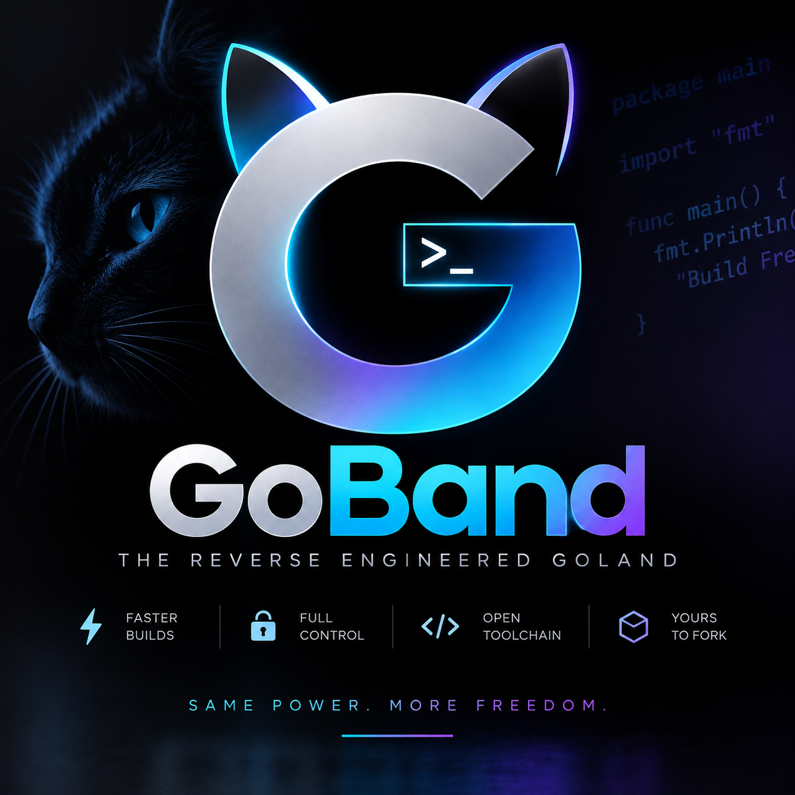

<p align="center">
  
</p>

# WinZip Electron IDE

Reverse-engineered GoLand rebuilt as a native Windows IDE in C# + C++.

No JVM. No Java. Native WPF shell + C++ core.

---

## What this is

This is GoLand reverse-engineered and reimplemented from scratch.

The reference was the GoLand 2026.2.2.1 installer. We observed the binary structure, filesystem behavior, process model, and UI workflow, then rebuilt those contracts as a clean native Windows application.

This is not a plugin, theme, wrapper, or fork. It is a standalone IDE that implements the same class of functionality as GoLand, written in C# and C++.

Not affiliated with JetBrains. JetBrains and GoLand are trademarks of JetBrains s.r.o.

## Why

GoLand runs on the JVM. This project does not.

- C# (WPF) for the IDE shell: workspace, project model, editor, tabs, panels, settings, build/run orchestration
- C++ for the native core: process execution, filesystem, terminal, PE/binary inspection, debugger boundary
- P/Invoke bridge between them

Goal: same IDE semantics, native Windows execution.

## How it was built

1. Binary observation -> reference artifact inspection (PE headers, sections, imports)
2. Behavior observation -> how the IDE manages projects, processes, filesystem, and terminals
3. Semantic contract -> define typed operations and results
4. Clean reimplementation -> independent C# + C++ code with no copied source, assets, or keys

No JetBrains source, binaries, assets, or license keys are included or copied in this repo.

## Architecture

```
Windows Shell
    |
C# IDE Application (WPF) - workspace, editor, project, UI state
    |
C# / Native Bridge (P/Invoke)
    |
C++ Native Core - process, filesystem, terminal, PE inspection
    |
Windows APIs
```

**Bridge ABI:**

`CreateProcess` | `TerminateProcess` | `ReadProcessOutput` | `WriteProcessInput` | `ReadFile` | `WriteFile` | `WatchPath` | `InspectPE` | `GetArchitecture` | `GetSections`

No UI logic lives in the native layer.

## Project layout

```
src/managed/     - C# WPF application (Program.cs, MainWindow, project model)
src/native/      - C++ native core (native_core.cpp/hpp - process + PE logic)
src/bridge/      - P/Invoke bridge (NativeBridge.cs)
build/           - CMake build for native library
specification/   - Architecture and boundary docs
```

## Reference artifact

Observations are from the installer container only, not source reconstruction:

| Field | Value |
|---|---|
| Product | GoLand |
| Product Version | 2026.2.2.1 |
| File Version | 262.10315.160 |
| Size | 917,514,392 bytes |
| PE Machine | 0x014C (I386) |
| PE Format | PE32 |
| Sections | .text, .rdata, .data, .ndata, .rsrc |

## Build

Prerequisites: Windows 10/11, .NET 8 SDK, CMake 3.25+, C++20 compiler (MSVC).

```powershell
# Build native core
cmake -S build -B build/out
cmake --build build/out --config Release

# Build and run IDE
dotnet build src/managed/WinZipIde.csproj -c Release
dotnet run --project src/managed/WinZipIde.csproj
```

Output: `winzip_native.dll` must sit alongside the managed executable for P/Invoke.

## Status

Early implementation.

- [x] WPF shell and main window
- [x] Native process execution (CreateProcessW)
- [x] File byte reading
- [x] PE inspection (DOS/NT headers, section table)
- [ ] Full editor, project tree, and panels
- [ ] Terminal and file watcher
- [ ] Debugger adapter
- [ ] Go toolchain integration

See `specification/architecture.md` for the intended panel and workspace model.

## Legal

Clean-room implementation. This project was built by observing public behavior of the GoLand installer and IDE, then writing new code to match the observed contracts.

No JetBrains code, binaries, branding assets, or proprietary implementation is redistributed here. If you own a JetBrains license, your license remains with JetBrains.

## License

GPL-3.0-or-later + Sovereign Source License v1.0. See `LICENSE`.

Copyright (c) 2026 SnapKittyWest / Bel Esprit D'Accord Trust.
